# Overview

This is the final project of the ``Cloud DevOps using Microsoft Azure Nanodegree Program``. You will find a set of screenshots with short explanations as per the project submission guidelines.

# Successful Pipeline Screenshots

## Environment Creation & Deployment

### Azure Pipeline

The following screenshots show different run of the Azure Pipeline, division of stages in the pipeline, as well as a detailed view of all individual jobs in the pipeline.

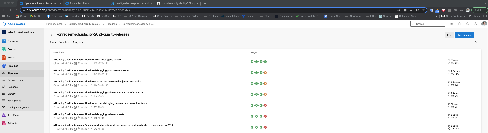

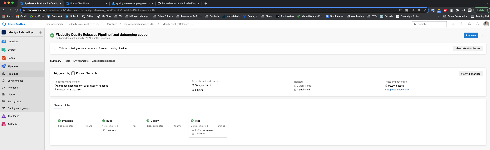

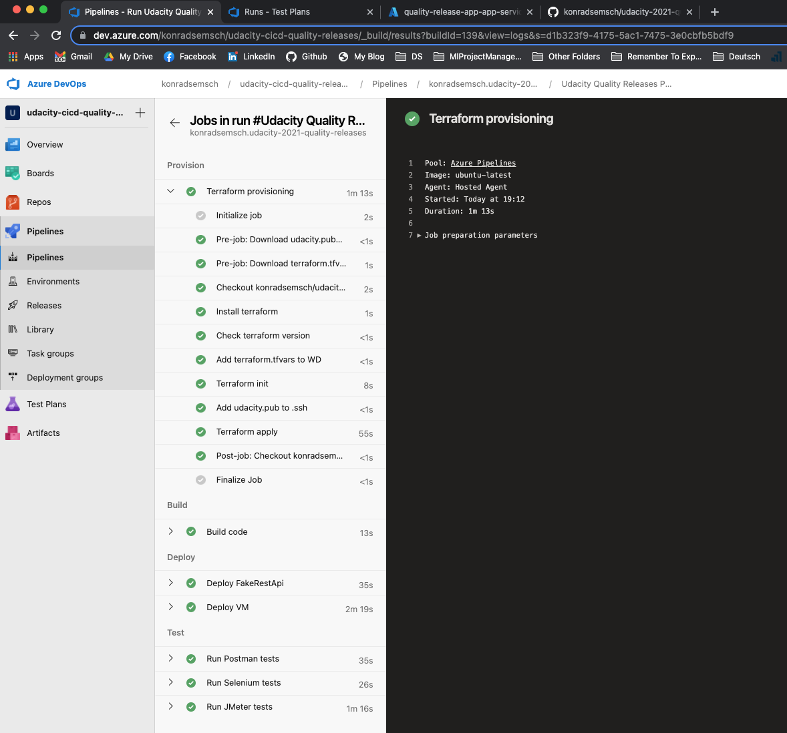

### Terraform

The following screenshot demonstrate application of Terraform in the pipeline in order to deploy the entire infrastructure used in this project.

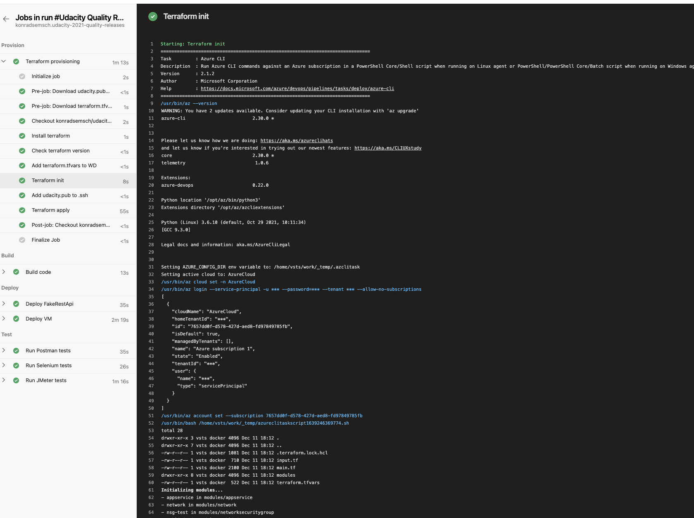

## Automated Testing

The following screenshots show the outcomes of executing different test suites in the pipeline.

### JMeter

Executing a total of 400 requests at different endpoints of the deployed ``FakeRestApi`` to Azure Service App using JMeter.

### Selenium

Executing a set of functional tests with Selenium against the ``https://www.saucedemo.com`` website.

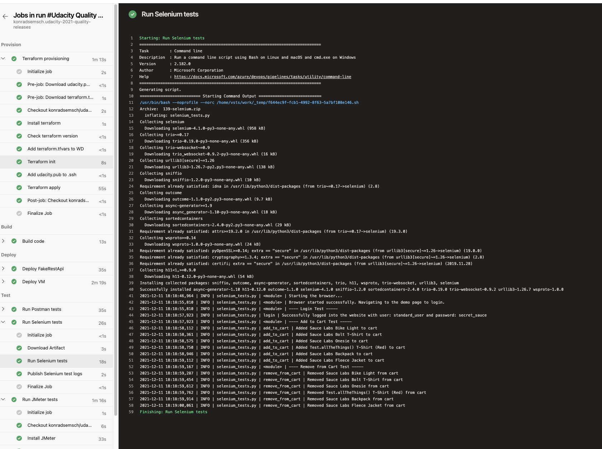

### Postman

Executing a set of regression and validation tests with Postman against the ``http://dummy.restapiexample.com`` API.

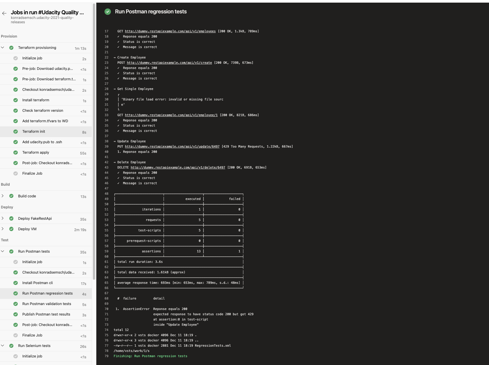

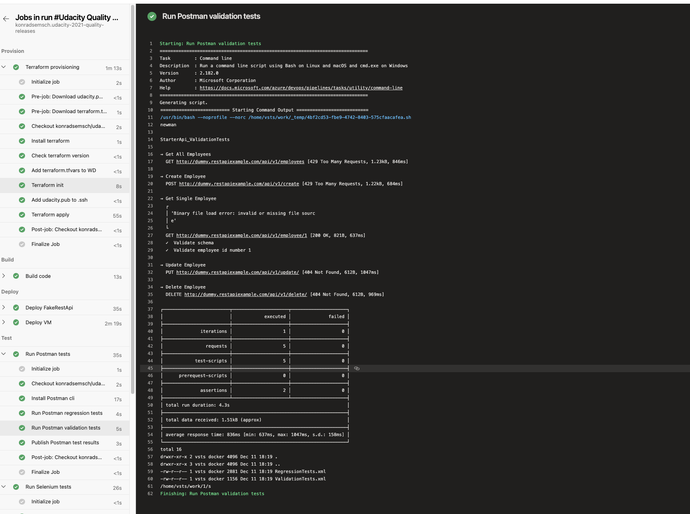

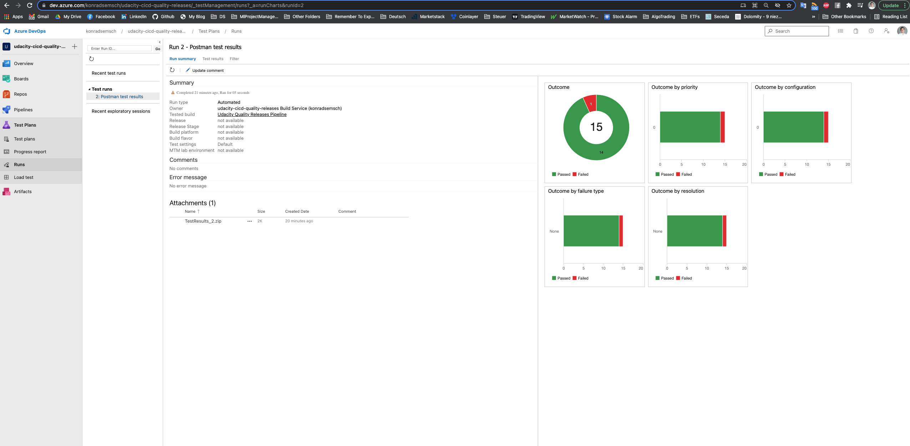

## Monitoring & Observability

### Azure Monitor

In the following screenshot you see the alert that was triggered by the stress tests executed by JMeter. Attached is the email notification, alert rule as well as graph that illustrates the number of requests made against the resource.

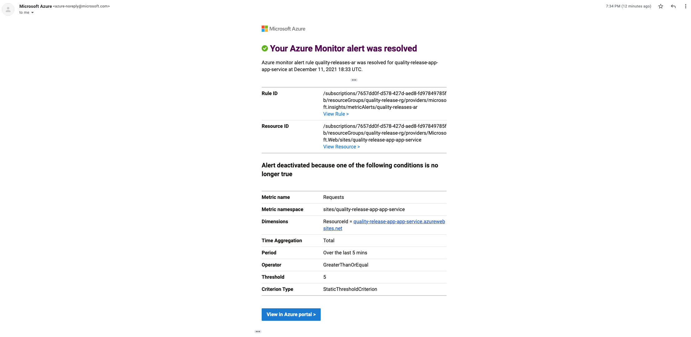

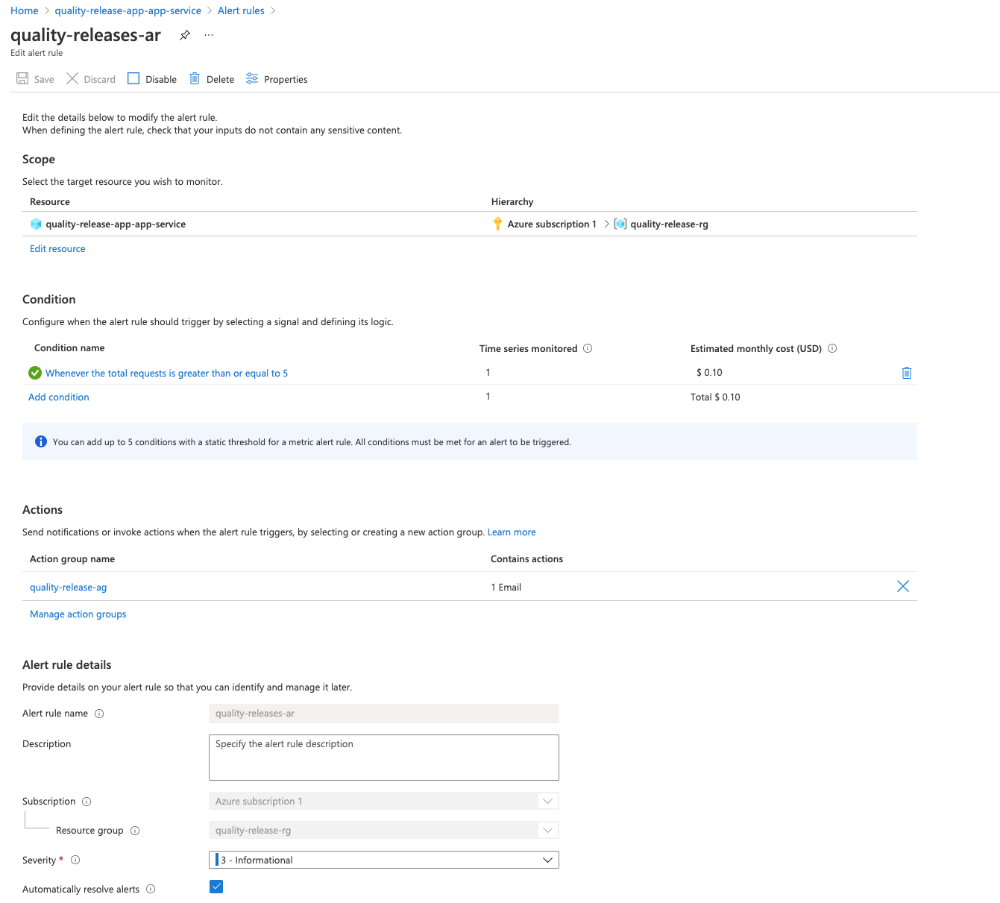

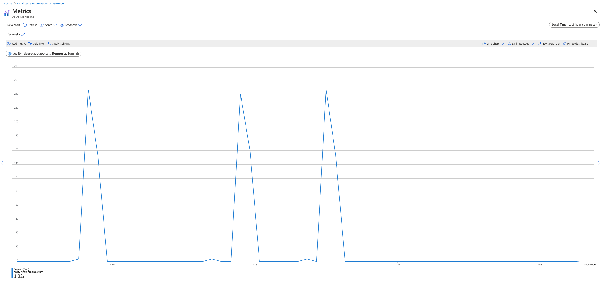

### Azure Log Analytics

NOTE: Still working on connecting log analytics, but wanted to submit my project already.

### Artefacts

Lists all artefacts produced by the pipeline.

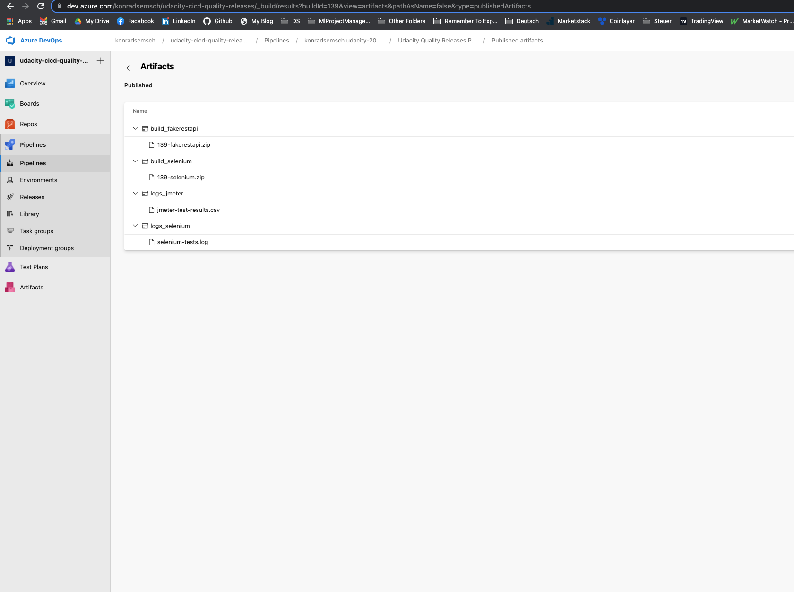